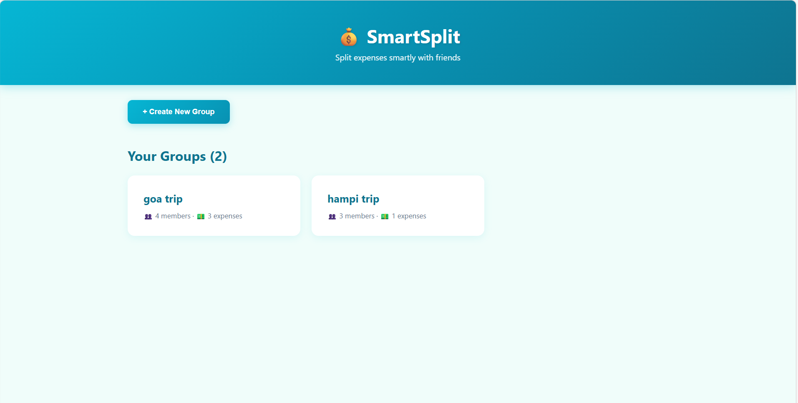

<<<<<<< HEAD

# SmartSplit 💰

A web app I built to solve a real problem - splitting expenses with friends without the headache of figuring out who owes whom!

## The Problem I Wanted to Solve

You know that situation when you go on a trip with friends? Someone pays for the hotel, someone else pays for food, and by the end, everyone owes everyone else money. Figuring out who should pay whom becomes a nightmare!

I realized that if 4 friends share expenses, traditionally you'd need up to 9-12 separate transactions to settle everything. That's ridiculous!

So I built **SmartSplit** to fix this.

## What It Does

SmartSplit uses a smart algorithm to minimize the number of payments needed. In that same 4-friend scenario, my app reduces it to just 3-4 transactions.

Here's how it works:

1. Create a group (like "Goa Trip")
2. Add your friends as members
3. Add expenses as they happen (who paid what, and who's splitting it)
4. Click "Settle Up" and boom - it tells you exactly who should pay whom, with the minimum number of transactions

## The Algorithm (The Cool Part!)

Instead of everyone paying everyone, I implemented what's called a **greedy cash flow minimization algorithm**:

1. **Calculate balances**: Figure out who's owed money (creditors) and who owes money (debtors)
2. **Smart matching**: Match the person who owes the most with the person who's owed the most
3. **Settle efficiently**: Keep matching until everyone's balanced

This approach reduces the time complexity from O(n²) to O(n), which in normal terms means WAY fewer transactions!

**Real Example from Testing:**

- Total expenses: ₹6000 among 4 friends
- Without my algorithm: Would need 9 separate payments
- With SmartSplit: Just 3 payments needed!

## Features I Built

- **Create Groups**: Organize expenses by trip, event, or whatever
- **Add Members**: Add friends to your groups
- **Track Expenses**: Record who paid what and how to split it
- **Smart Settlement**: Get optimized payment plan with minimum transactions
- **Mark as Paid**: Check off payments as friends complete them
- **Data Saves**: Your data stays even if you close the browser (thanks to LocalStorage)
- **Mobile Friendly**: Works on phones too!

## Tech Stack

I built this using:

- **React** - For the UI and all the interactive stuff
- **JavaScript** - For the algorithm and logic
- **CSS3** - For making it look good (went with a teal color scheme to stand out)
- **LocalStorage** - So your data doesn't disappear when you refresh

## How to Run It

If you want to try it out:

```bash
# Clone this repo
git clone https://github.com/R-M-Harshitha/expense-splitter.git

# Go to the frontend folder
cd expense-splitter/frontend

# Install dependencies
npm install

# Start it up
npm start
```

Then open `http://localhost:3000` in your browser!

## Screenshots

### Homepage - Your Groups


_Create and manage multiple expense groups_

### Group Details - Track Expenses

.png>)
.png>)
_Add members and expenses with flexible splitting options_

### Settlement Summary - Smart Algorithm in Action

.png>)
.png>)
_Optimized settlement with minimum transactions needed_

## What I Learned

This was my first real React project, and I learned a TON:

- How to manage state in React (useState hooks are powerful!)
- Implementing actual algorithms, not just coding tutorials
- Making UI that people would actually want to use
- Git workflow and version control
- Breaking down a complex problem into smaller pieces

The hardest part? Getting the algorithm right. I spent hours debugging why my balances weren't adding up to zero. Turns out, floating point precision is a thing! 😅

## Future Plans

Things I want to add:

- [ ] Backend with database so you can access your groups from any device
- [ ] Send settlement reminders to friends
- [ ] Export settlement summary as PDF
- [ ] Add expense categories and spending analytics
- [ ] Integration with UPI for direct payments

## Why I Built This

Honestly?
During our last bangalore trip, we spent an hour after checkout trying to figure out who owed whom. That's when I realized - there has to be a better way! So I built SmartSplit. And I wanted to build something that my friends and I would actually use. Plus, I needed a good project for my portfolio for placements!

## Contributing

Found a bug? Have an idea? Feel free to open an issue or submit a pull request!

## Connect With Me

- GitHub: [@R-M-Harshitha](https://github.com/R-M-Harshitha)
- Project Link: [SmartSplit](https://github.com/R-M-Harshitha/expense-splitter)

---

Built with lots of coffee ☕ and debugging 🐛 by Harshitha
